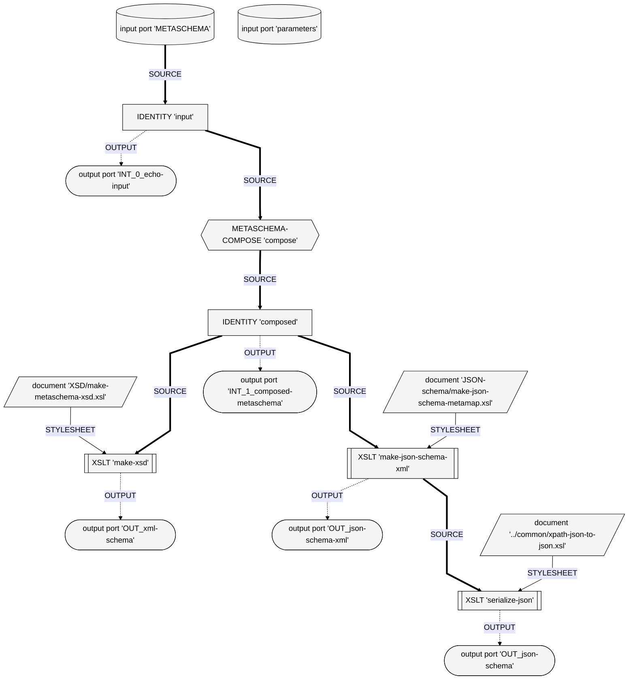

# Flowcharts

Showing XProc as a flowchart between states (representations), operations (transformations) and dependencies (read-write interfaces)

## XProc METASCHEMA-ALL-SCHEMAS.xpl

To update:
- Drop file on the [XProc Visualizer](https://pages.nist.gov/xslt-blender/xproc-visualizer/)
- Move `serialize-json_stylesheet_document` to the end for better placement
- Hit Enter

